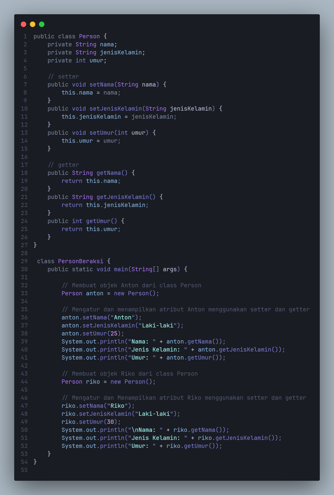
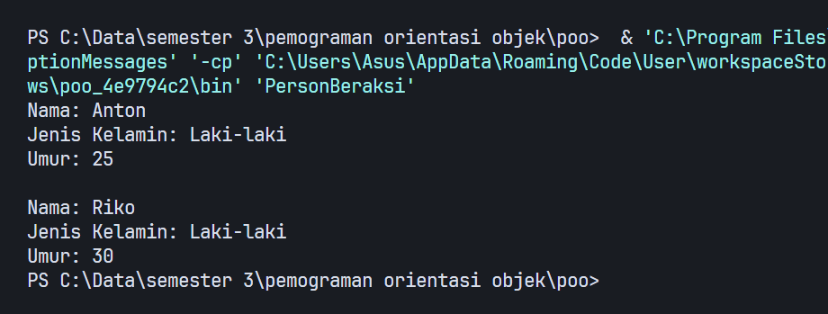

# Praktikum2
### Zaky Putra Pratama
### TI.23.A6
## Latihan 1
Buatlah kode program java untuk:<br>
• Mendeklarasikan class Person, dengan atribut Nama, JenisKelamin, Umur dan lengkapi dengan access modifier.<br> 
• Buatlah dua buah objek dari class Person bernama Anton dan Riko dan panggil method setter dan getter.<br>
### Program:

### Output Program:

### code
```java
public class Person { 
    private String nama;
    private String jenisKelamin;
    private int umur;

    // setter
    public void setNama(String nama) {
        this.nama = nama;
    }
    public void setJenisKelamin(String jenisKelamin) {
        this.jenisKelamin = jenisKelamin;
    }
    public void setUmur(int umur) {
        this.umur = umur;
    }

    // getter
    public String getNama() {
        return this.nama;
    }
    public String getJenisKelamin() {
        return this.jenisKelamin;
    }
    public int getUmur() {
        return this.umur;
    }
}

 class PersonBeraksi {  
    public static void main(String[] args) { 

        // Membuat objek Anton dari class Person
        Person anton = new Person();

        // Mengatur dan menampilkan atribut Anton menggunakan setter dan getter
        anton.setNama("Anton");
        anton.setJenisKelamin("Laki-laki");
        anton.setUmur(25);
        System.out.println("Nama: " + anton.getNama());
        System.out.println("Jenis Kelamin: " + anton.getJenisKelamin());
        System.out.println("Umur: " + anton.getUmur());

        // Membuat objek Riko dari class Person
        Person riko = new Person();
        
        // Mengatur dan Menampilkan atribut Riko menggunakan setter dan getter
        riko.setNama("Riko");
        riko.setJenisKelamin("Laki-laki");
        riko.setUmur(30);
        System.out.println("\nNama: " + riko.getNama());
        System.out.println("Jenis Kelamin: " + riko.getJenisKelamin());
        System.out.println("Umur: " + riko.getUmur());
    }
}
```
